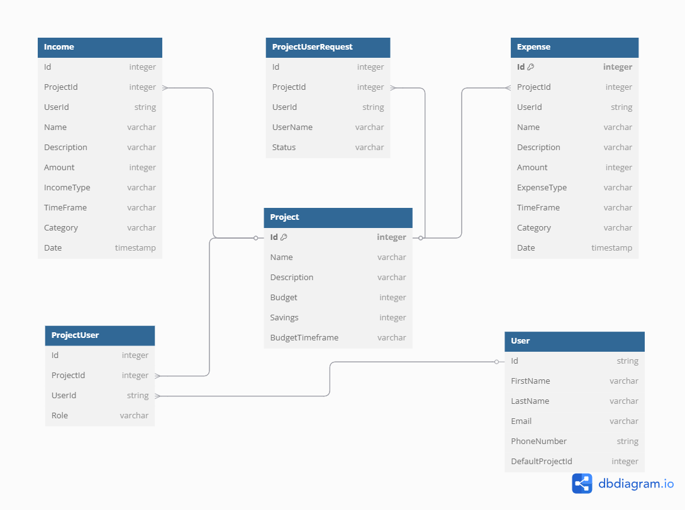

# Outgo-tracker

> The purpose of this Project is to develop an Expense tracking app that is user friendly and easy to use both on desktop and mobile.
>
> I researched and could not find any app out in the market that you can use to collaborate expense tracking with other people. Through this app I have made an effort to fill that gap.

This is database diagram of the app.

